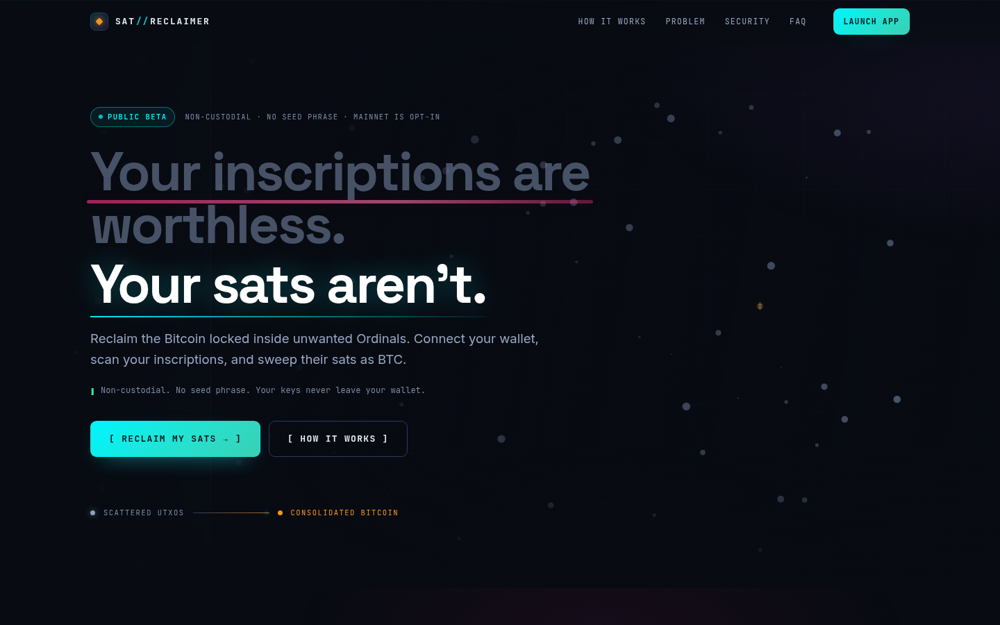

# SAT//RECLAIMER

**FREE SOFTWARE. NO PLATFORM FEES. BITCOIN NETWORK FEES STILL APPLY.**

A free, open-source, non-custodial web app for deliberately spending the bitcoin
locked inside inscription-bearing Taproot (P2TR / BIP86) UTXOs and sweeping it to
one destination address you choose. Your wallet signs; this app never holds a key,
never takes custody, and never broadcasts anything you have not authorized one
exact transaction at a time.

An inscription-bearing UTXO is still a Bitcoin UTXO. This app does not delete
inscriptions, convert Ordinals into Bitcoin, or take custody of anything. It lets
an owner opt selected `bc1p` outputs back into ordinary coin selection after an
explicit destructive-asset acknowledgement — and it is honest about what that
does and does not do.

- **[Local setup](docs/LOCAL_SETUP.md)** — how to install and run it on your own machine.
- **[Risk disclosure](docs/RISK.md)** — read this before Mainnet.
- **[Release gates](docs/RELEASE_GATES.md)** — exactly what is proven and what is not.
- **[Release candidate v0.1.0-rc.1](docs/RELEASE_NOTES_v0.1.0-rc.1.md)** — prepared, **not published**; source-only.
- **License:** [MIT](LICENSE)




## What it is

Bitcoin wallets protect ordinal-bearing UTXOs from ordinary coin selection, which
is why thousands of small inscription outputs sit unspendable-looking in a wallet.
Reclaiming them means opting out of that protection on purpose and paying the
Bitcoin network fee to consolidate the sats that are actually there. Most of those
outputs hold a few hundred sats, so this is often a decision about postage value
rather than a windfall — the app shows you the arithmetic before you sign.

## Features

- **One-click Sweep All.** Scan the whole wallet, select everything, preview fees,
  sign, verify, broadcast. No bulk checkbox clicking and no manual repartitioning.
- **Sized by measurement, not by a formula.** The planner builds the candidate
  transaction, injects key-free placeholder signatures of the exact size Xverse
  returns, finalizes it, and reads the real relay weight from the serialized
  artifact. 1,083 inputs fit in one transaction; larger wallets split into the
  minimum number of batches automatically.
- **Independent verification.** The signed PSBT is decoded by code that shares no
  state with the builder, and every input's BIP341 sighash and Schnorr signature is
  re-checked locally before anything else can happen.
- **Signing and broadcasting are separate actions.** Signing is sent with
  `broadcast: false`. Broadcasting needs its own operator flag, a per-`txid`
  authorization, and it submits the verified raw bytes to independent public nodes
  — never to the wallet.
- **No automatic anything.** No auto-broadcast, no resubmission after an ambiguous
  response, no signed replacement, no "resume and submit" from storage.
- **Zero platform fees.** There is no fee, percentage, tier, account or upsell in
  the code or the product.

## Supported wallet and networks

| | |
| --- | --- |
| Wallet | **Xverse**, via Sats Connect (`sats-connect@4.2.1`). Only Xverse is supported today. |
| Networks | Signet/Testnet and Mainnet. **Mainnet is off by default** and requires an explicit operator flag. |
| Browser | Any current Chromium/Firefox/Safari with the Xverse extension installed. |

### Network behaviour

Mainnet and the test networks behave identically in the workflow, with different
defaults:

- **Mainnet is never a default.** `NEXT_PUBLIC_ENABLE_MAINNET=true` is an explicit
  operator decision. With it off, the console refuses the Mainnet workflow rather
  than quietly building a real-BTC transaction.
- **Mainnet broadcasting needs a second flag.**
  `NEXT_PUBLIC_ENABLE_MAINNET_BROADCAST=true` on top of Mainnet. Enabling Mainnet
  for building never moves real BTC by itself.
- **Signet/Testnet broadcasting** has its own flag
  (`NEXT_PUBLIC_ENABLE_SIGNET_BROADCAST=true`) and can never unlock Mainnet.
- A build must be correct with all three flags `false`; that is what CI builds.

## How Bitcoin mining fees work here

This project charges nothing. The only cost is the Bitcoin network fee, which is
paid to miners, not to anyone involved with this app.

The fee is `vsize × fee rate`. Each Taproot input costs about 230 weight units
(~57–58 vB) to spend, so a sweep of 1,000 inputs is roughly 62,000 vB: at
1 sat/vB that is about 62,000 sats of fee. Because most inscription outputs hold a
few hundred sats, a high fee rate can consume most of the value. So:

- the app fixes the fee from the **measured** final transaction, never an estimate
  that can drift;
- it shows the exact fee, the exact destination output, and the fee as a
  percentage of recovered value before you sign;
- it warns prominently above 25%;
- it evaluates the whole selected set together, so 1,083 small UTXOs can be a valid
  sweep even when any one of them alone would not be;
- net recovery is `inputs − mining fee`, never the gross input total.

## Run it locally

Requires **Node.js 22+** and **pnpm 10**. No database, no Docker, no server, no
administrator rights.

```bash
git clone https://github.com/echelong/sat-reclaimer.git
cd sat-reclaimer
corepack enable      # use the pinned pnpm 10.17.1 from packageManager
pnpm install
pnpm local           # asks which mode to run in, then serves 127.0.0.1:3000
```

Then open <http://127.0.0.1:3000> (landing) or <http://127.0.0.1:3000/app> (the
reclaim console). `pnpm local` prints exactly what it is about to enable, and its
default mode — the one you get by pressing Enter — cannot spend anything. It binds
to `127.0.0.1` only, so it is never reachable from your network.

Full per-platform instructions (Fedora/Linux, macOS, Windows), the manual
`--frozen-lockfile` path, the mode table and troubleshooting are in
**[docs/LOCAL_SETUP.md](docs/LOCAL_SETUP.md)**. Check your machine first with:

```bash
pnpm local:check  # read-only: Node, pnpm, dependencies, platform
```

```bash
pnpm lint         # eslint
pnpm typecheck    # tsc --noEmit
pnpm test         # full offline suite (no network, no Mainnet)
pnpm build        # production build
pnpm verify       # lint + typecheck + test + build
pnpm test:max     # 10,000-UTXO scale run; see docs/PERFORMANCE.md
```

### Environment

`pnpm local` sets the three product flags for you — you do not need to edit any
file to run the app. For the manual/advanced path, copy `.env.example` to
`.env.local`; every flag is off unless set to exactly `true`.

```bash
NEXT_PUBLIC_ENABLE_MAINNET=false
NEXT_PUBLIC_ENABLE_SIGNET_BROADCAST=false
NEXT_PUBLIC_ENABLE_MAINNET_BROADCAST=false
```

`NEXT_PUBLIC_SITE_URL` sets the origin that canonical URLs, `og:url` and
`sitemap.xml` are built from; without it they fall back to
`http://localhost:3000`. For a local Mainnet rehearsal:

```bash
NEXT_PUBLIC_ENABLE_MAINNET=true NEXT_PUBLIC_ENABLE_MAINNET_BROADCAST=true pnpm dev
```

`NEXT_PUBLIC_*` values are **public browser configuration, not secrets and not an
authorization boundary.** The controls a user sees are UI state; the broadcast
layer re-checks the flags and the per-transaction authorization in code and
refuses regardless of what the UI believes. Never put a key or a credential in a
`NEXT_PUBLIC_*` variable.

## Workflow

Connect Xverse → Scan wallet → acknowledge the destructive warning → select UTXOs
→ enter a destination address and fee rate → **Build** unsigned PSBTs → **Sign**
with Xverse → the app **verifies** the signed PSBT → review the exact verified
transaction → authorize that `txid` → **Broadcast** to independent nodes →
**Check confirmation**.

`Build`, `Sign`, `Verify` and `Broadcast` are four separate actions. Nothing is
fused into one opaque button, and signing never broadcasts.

### Sweep All

1. **Scan the whole wallet.** Pages are fetched until the indexer total is
   exhausted or the provider returns an empty page. The app reports the
   indexer-reported total, inscriptions retrieved, unique UTXOs, total sats, pages
   read and duplicates skipped, and it refuses to sweep an incomplete scan.
2. **Sweep All.** Every retrieved UTXO goes into the sweep.
3. **Sized by measurement.** 1,083 × 10,000-sat inputs measure 249,312 WU
   (62,328 vB) and fit in **one** transaction. Anything that cannot fit is split
   into the minimum number of batches, presented as Batch 1…N.
4. **One-click fallback.** If Xverse rejects a large payload, the app classifies
   the rejection and re-plans the same wallet into more batches. No validation is
   relaxed to make a rejection pass.
5. **Aggregate fee economics.** The fee check evaluates the whole selected set.

### Interrupted sessions and imports

A signed transaction lives in browser memory only, so a refresh discards it — the
reasons, and the safe design for persisting it, are written up in
[docs/PUBLIC_BETA.md](docs/PUBLIC_BETA.md). The console can save the verified raw
transaction as a `.hex` file, and a raw transaction is public network data with no
key material in it.

An imported raw transaction **never** inherits a previous approval: it gets a fresh
per-`txid` acknowledgement, it is decoded and re-derived locally, it never
auto-broadcasts, and where the original approval evidence is absent the app reports
which fields it cannot verify instead of assuming them.

## Security posture

- **No keys, ever.** No page has a field for a seed phrase or private key, and no
  code path can obtain one. The app never asks for, derives, stores, transmits or
  logs one.
- **The address is proven.** The Ordinals address is checked to be the BIP86 output
  of the public key the wallet reported, or the flow stops.
- **Indexer responses are untrusted input.** Rows with malformed outpoints, invalid
  postage, foreign addresses or conflicting postage for one outpoint are quarantined
  rather than silently swept, and inputs are deduplicated by `txid:vout`.
- **Conservation is enforced** on the serialized artifact: `Σinputs = Σoutputs + fee`.
- **Asset detection is structurally incomplete.** The Sats Connect inscriptions API
  cannot report runes, BRC-20 balances or rare sats. The app therefore never claims
  an output is "safe" and never infers safety from an inscription count.
- **Strict CSP and headers.** `default-src 'none'`, `frame-ancestors 'none'`,
  `connect-src` limited to the public broadcast hosts this app actually uses. See
  [`next.config.ts`](next.config.ts).
- **Shipped dependencies are audited on every change.** CI fails on any high or
  critical advisory in the tree that ships, and on any *new* one anywhere in the
  tree. One dev-only advisory with no patched release is waived by name, with its
  reasoning, in `scripts/audit-allowlist.mjs`. Two advisories inherited from
  `sats-connect` (`axios`, `valibot`) are forced forward with `pnpm.overrides`.
  See [SECURITY.md](SECURITY.md#dependencies).
- **Not audited.** No independent external security review has been performed. The
  internal review, its findings and its scope limits are in
  [docs/SECURITY_REVIEW.md](docs/SECURITY_REVIEW.md); the gate that stays open
  because of it is in [docs/RELEASE_GATES.md](docs/RELEASE_GATES.md).

**The inscription is not erased.** Its contents stay on chain at the genesis
location forever; what changes is which output carries it and who controls that
output. Spending an inscription output can move or permanently affect whatever it
carries, including rare sat ranges, rune balances and BRC-20 state. Bitcoin
transfers are irreversible and there is no support process, no refund and no
recovery path.

## Trust model

1. Xverse exposes the Ordinals P2TR address and its public key.
2. The app proves the address is that key's BIP86 output, or refuses to continue.
3. `ord_getInscriptions` enumerates inscriptions; every row is validated as
   untrusted input.
4. Rows are reduced to a unique `txid:vout` set. Multiple inscriptions sharing one
   output are counted once.
5. The PSBT is built and then re-decoded from its serialized form; every number the
   user sees comes from that decode.
6. Xverse signs exactly the listed input indexes with `broadcast: false`.
7. The returned PSBT is decoded again and checked against the plan: inputs, prevout
   values, input scripts, single output, destination script, amount, fee,
   conservation, txid stability, and a Schnorr signature verification per input.
8. Broadcasting is a separate action behind two explicit operator flags and a
   per-transaction authorization. The verified raw bytes are re-hashed locally and
   POSTed to independent public nodes; the wallet never broadcasts, a mismatched
   returned txid aborts the flow, and an ambiguous response is resolved by a txid
   lookup rather than a resubmission.

Import direction is one-way: the presentation layer (landing page, hero,
simulated demo) imports nothing from the Bitcoin engine, so the demo cannot sign
or broadcast by construction rather than by discipline.

## Third-party services

There is no account, no analytics, no tracker and no server-side storage of wallet
data. Requests leave your browser to exactly these hosts:

| Service | What it receives | Why |
| --- | --- | --- |
| Xverse (wallet extension) | Your addresses and the signing request | It is your wallet |
| Ordinals indexer (via Sats Connect) | Your Ordinals address | To enumerate inscriptions |
| `mempool.space`, `blockstream.info`, `mempool.emzy.de` | The raw transaction, or a `txid` lookup | Public broadcast and status endpoints you explicitly authorize |

See [`/privacy`](app/privacy/page.tsx) and [`docs/RISK.md`](docs/RISK.md).

## Known limitations

- **Xverse only.** No second signer to fall back to.
- **Asset detection is incomplete.** Runes, BRC-20 and rare sats are invisible to
  the API this app can read.
- **The provider's real payload limit is unproven.** Synthetic signing up to 10,000
  inputs is measured
  ([docs/PERFORMANCE.md](docs/PERFORMANCE.md)), but the largest input count approved
  by a real wallet is 1,079. A very large sweep may need several signature requests.
- **No external security audit.**
- **No live Signet end-to-end run** — there is no inscription-bearing Signet UTXO
  to spend.
- **A refreshed tab loses an unsigned batch.** Mitigated by *Download verified
  .hex*; automatic recovery is deliberately not implemented.
- **Broadcast endpoints are third parties.** They see the transaction, as any node
  would; behaviour under rate limiting and outage is handled but not exhaustively
  tested against live services.
- **Single-network destination.** The destination must be valid on the same network
  as the inputs; the app never converts between networks.

## The confirmed Mainnet sweep

The operator swept a real 1,079-input inscription wallet on Mainnet:

| | |
| --- | --- |
| txid | `0a7d30ca8f940b137c96c65bb32ffec34f53a8a128cadf154f8df83055257e1a` |
| block | 970454 |
| weight / vsize | 248,348 WU / 62,087 vB |
| fee | 62,087 sats at exactly 1 sat/vB |
| inputs / outputs | 1,079 key-path P2TR inputs → one P2SH output of 539,127 sats |

Every number was independently re-derived from the raw bytes, and the analytic
weight model matched the chain to the byte. What that does and does not prove is
written out in [docs/MAINNET_ACCEPTANCE.md](docs/MAINNET_ACCEPTANCE.md).

## Contributing

Contributions are welcome — especially adversarial review of the transaction path.
Start with [CONTRIBUTING.md](CONTRIBUTING.md), and read the Bitcoin-safety impact
table in the pull-request template before proposing a change to anything that
touches inputs, outputs, fees, signing or broadcasting.

Security issues should not be filed as public issues; see [SECURITY.md](SECURITY.md).
Participation is covered by the [Code of Conduct](CODE_OF_CONDUCT.md).

## License

[MIT](LICENSE) © 2026 echelong. Bundled and transitively required third-party
licences are listed in [LICENSE](LICENSE).

## API notes (verified against the installed packages)

Checked against `sats-connect@4.2.1` and `@scure/btc-signer@2.4.1` type
declarations rather than examples found online:

- `request(method, params)` is re-exported from `@sats-connect/core` by
  `sats-connect`; the singleton `Wallet` class is the other entry point.
- `wallet_connect` takes `{ addresses, message (≤80 chars), network }` and returns
  `{ addresses[], walletType, network.bitcoin.name }`. The reported network is
  compared with the requested one and a mismatch stops the flow.
- `ord_getInscriptions` takes `{ offset, limit }` and returns
  `{ total, limit, offset, inscriptions[] }`.
- `signPsbt` takes `{ psbt, signInputs: { [address]: number[] }, broadcast }` and
  returns `{ psbt, txid? }`. There is no `finalize` option in this version.
- `wallet_disconnect` takes `null | undefined`.
- `selectUTXO(..., 'all', ...)` is the exact fee/vsize estimator used for building.
  Its weight for a one-output P2TR sweep matches the signed transaction exactly, and
  a 500-input batch is 115,214 WU against a 400,000 WU limit.
- If the remainder after fees is below the dust/relay threshold the estimator emits
  **zero outputs and burns the whole batch as fee**. The builder detects that and
  refuses instead.

`@noble/curves` and `@noble/hashes` are direct dependencies (the same versions
`@scure/btc-signer` already pins) so the verifier can compute its own BIP341 sighash
and check Schnorr signatures without trusting the builder's library call.
